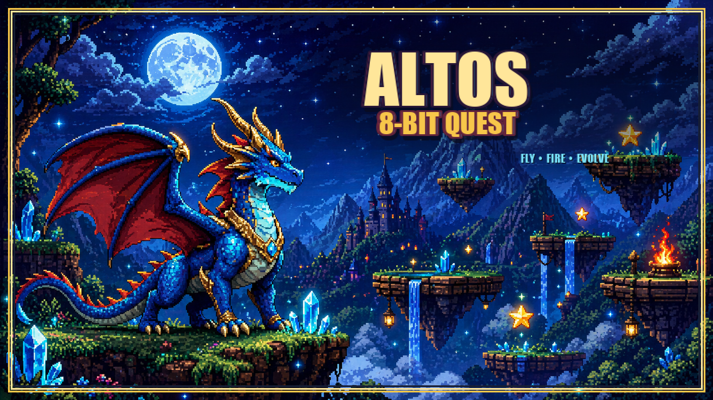

# Altos 8-Bit Quest

A separate 8-bit retro version of the Altos dragon game.

Open `index.html` in a browser.

Controls:

- Enter: start / select dragon / hatch faster / continue
- A / D or arrows on the selection screen: preview locked future dragon slots
- A / D or arrows: move
- W / Space / Arrow Up: flap / fly upward
- S / Arrow Down: fast fall
- J / X / click: fire
- P: pause
- R or RESET: restart
- Mobile: an on-screen arrow keyboard appears automatically for movement, flying, start/select, and fire

Built as a pixel-perfect HTML5 Canvas game with 320x180 game logic rendered into a sharper 640x360 buffer, nearest-neighbor scaling, fixed-step simulation, keyboard state input, and simple Web Audio chiptune effects.

The hatch sequence uses a custom 14-frame transparent 8-bit egg sprite sheet inspired by the jeweled turquoise-and-gold reference egg.

Dragon sprites:

- Generated sheets live in `assets/sprites/`.
- Each sheet is 8 frames of 128x128 pixels: `idle1`, `idle2`, `run1`, `run2`, `run3`, `fly1`, `fly2`, `fire`.
- `assets/sprites/altos_01_sheet.png` through `altos_06_sheet.png` are Altos evolution stages made from the supplied dragon images.
- `assets/sprites/altos_young_pose_atlas.png` is a full animation atlas for Altos Young with `Idle`, `Attack`, `Hurt`, `Dead`, `Flight`, `Jump`, and `Walk` rows. `characters.js` maps those rows into the game animation system.
- The current character selection screen shows Altos plus silhouette placeholders for future dragons. Add the nephews' and nieces' dragons later as separate selectable characters after their visuals exist.

Deployment:

- GitHub Pages: enable Pages for this repo from the `main` branch and `/` root.
- Cloudflare Pages direct upload: `npx wrangler pages deploy . --project-name altos-8-bit-quest --branch main`
